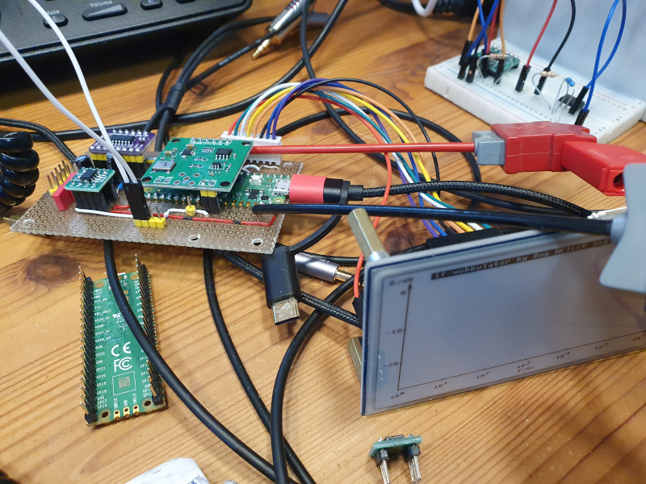

# lf_wobbulator

## Measure the frequency response of filter up to 1MHz

*** under heavy construction, but coming soon ***

## All infos on: <http://www.weigu.lu/microcontroller/lf_wobbulator/index.html>

## Some infos

#### BOM

-
-
-
-
-
-
-
